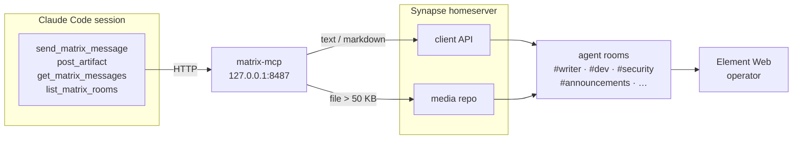

# matrix-mcp

FastMCP server providing Matrix homeserver communication tools for claudebox agent sessions.



## Tools

| Tool | Description |
|------|-------------|
| `send_matrix_message` | Send a message to a named agent room |
| `get_matrix_messages` | Fetch recent messages from a room |
| `list_matrix_rooms` | List all agent rooms with IDs |
| `post_artifact` | Post a file's contents to a room (markdown rendered as HTML; >50KB uploaded as attachment) |

Room names are short names (`dev`, `task-queue`, `approvals`, etc.) — no `#` or `!` prefix needed.

## Rooms

| Short name | Purpose |
|------------|---------|
| `task-queue` | Task dispatcher events |
| `approvals` | Pending approval requests |
| `research` | Research agent activity |
| `claudebox` | Claudebox agent activity |
| `dev` | Dev agent activity |
| `helm-build` | Helm build agent activity |
| `homelab-ops` | Homelab ops agent activity |
| `security` | Security audit findings |
| `pr` | PR / outreach agent activity |
| `writer` | Writer agent activity |
| `announcements` | Cross-agent system announcements |

## Setup

```bash
cd ~/repos/personal/matrix-mcp
python3 -m venv venv
venv/bin/pip install -r requirements.txt
```

Credentials are loaded from `~/.claude-secrets/matrix.env` (or the path in `ENV_FILE`). Required vars:

```
MATRIX_HOMESERVER_URL=https://matrix.claudebox.me
MATRIX_BOT_USER_ID=@claude-agent:claudebox.me
MATRIX_ACCESS_TOKEN=<bot token>
MATRIX_ROOM_TASK_QUEUE=!...:claudebox.me
MATRIX_ROOM_APPROVALS=!...:claudebox.me
MATRIX_ROOM_RESEARCH=!...:claudebox.me
MATRIX_ROOM_CLAUDEBOX=!...:claudebox.me
MATRIX_ROOM_DEV=!...:claudebox.me
MATRIX_ROOM_HELM_BUILD=!...:claudebox.me
MATRIX_ROOM_HOMELAB_OPS=!...:claudebox.me
MATRIX_ROOM_SECURITY=!...:claudebox.me
MATRIX_ROOM_PR=!...:claudebox.me
MATRIX_ROOM_WRITER=!...:claudebox.me
MATRIX_ROOM_ANNOUNCEMENTS=!...:claudebox.me
```

## Running

### PM2 (production)

```bash
pm2 start ~/repos/personal/matrix-mcp/ecosystem.config.json
pm2 save
```

### Manual

```bash
cd ~/repos/personal/matrix-mcp
ENV_FILE=~/.claude-secrets/matrix.env venv/bin/fastmcp run server.py --transport http --host 127.0.0.1 --port 8487
```

## Claude Project Integration

Add to `~/.claude.json` global MCP servers:

```json
{
  "mcpServers": {
    "matrix": {
      "type": "http",
      "url": "http://127.0.0.1:8487/mcp"
    }
  }
}
```

## Security

- Binds to `127.0.0.1` only — not reachable from LAN
- `post_artifact` validates paths against an allowlist before any filesystem access
- `get_matrix_messages` limit is capped at 100
- Unknown room names raise an error — never treated as literal room IDs
- Credentials asserted at startup; server exits with error if any are missing
